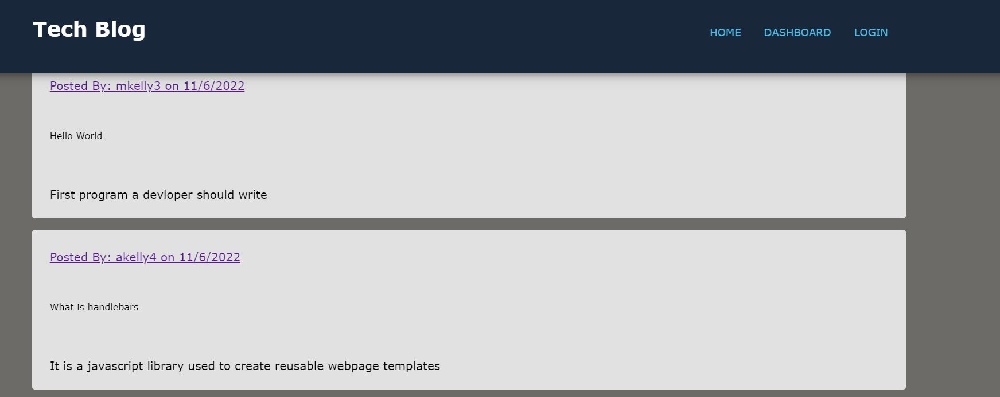
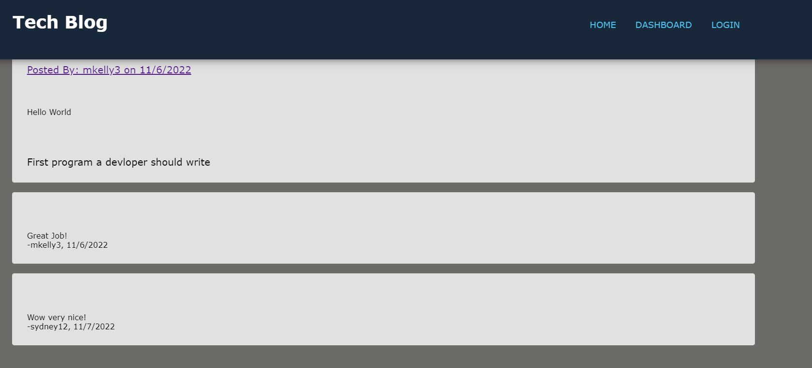
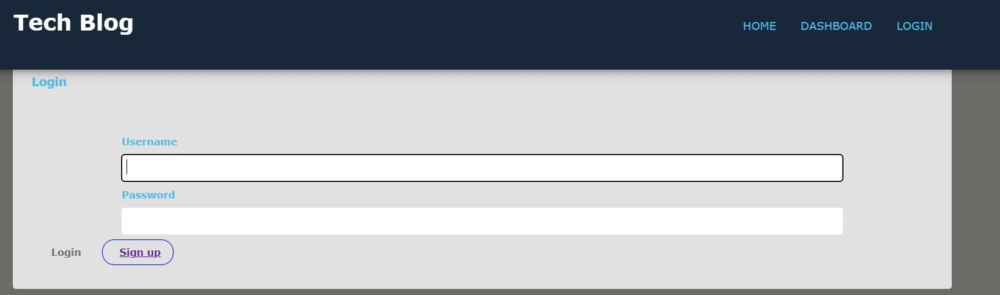

# Tech Blog Site

[Click Here](https://git.heroku.com/tech-blog-25.git) to Launch Application 

## Table of Contents
- [Description](#description)
- [Image](#image))
- [Code Snippet](#code-snippet)
- [Technologies Used](#technologies-used)
- [Installation](#instalation)
- [Contact Information](#contact-information)

## Description
A fullstack application that allows users to sign up and or login and make blog posts. Once a User is logged in they are taken to their dashboard where they can create, edit or delete blog posts. On the homepage a user can make comments on other blog posts. The blog posts contain the name of the user, the date created, the post title and finallly the content. 

## Technologies Used
- JavaScript
- Node.js
- MySQL
- Express.js
- Handlebars.js
- 

## Instalation
- inquirer
- mysql2
- dotenv
- sequelize
- express-handlebars
- bcrypt
- express-session
- connect-session-sequelize

## Contact Information 
- [GitHub](https://github.com/mkelly3/)
- [Linkedin](https://www.linkedin.com/in/morgan-kelly15/)

